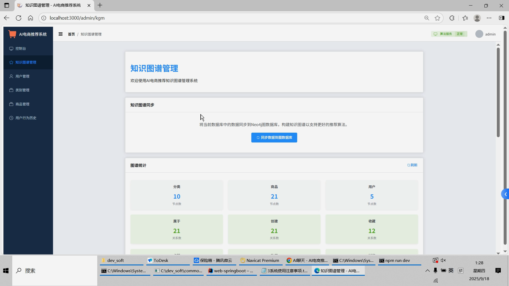

## 计算机毕业设计对标硕论DeepSeek大模型+知识图谱Neo4J电商商品推荐系统 SpringBoot+Vue.js

## 要求
### 源码有偿！一套(论文 PPT 源码+sql脚本+教程)

### 
### 加好友前帮忙start一下，并备注github有偿26大模型电商
### 我的QQ号是1679232425 或者798059319或者2827724252 或者微信:biyesheji1698 或者 bysj2023nb

# 

### 加qq好友说明（被部分 网友整得心力交瘁）：
    1.加好友务必按照格式备注
    2.避免浪费各自的时间！
    3.当“客服”不容易，repo 主是体面人，不爆粗，性格好，文明人。
## 主要功能 
###  创新点：5种大模型、2种推荐算法、可视化、知识图谱图神经网络推荐、大模型精调
```
基于DeepSeek和知识图谱(Neo4j图数据库)的电商AI推荐系统
技术栈：Vue3+ElementUI Plus+Flask+PyTorch+SpringBoot3+MybatisPlus+Qwen+DeepSeek+Neo4j
项目最后有环境依赖安装和部署运行演示教程(有项目较详细的说明文档)
主要功能：
用户端功能
商品浏览：商品列表、详情查看、搜索筛选
个性化推荐：基于用户行为的智能推荐
智能对话：AI助手对话式商品推荐
用户行为：收藏、点赞、评论、购买记录
管理端功能
用户管理：用户信息查看、状态管理
商品管理：商品CRUD操作、分类管理
知识图谱管理：数据同步、图谱可视化、统计分析
核心推荐功能
协同过滤推荐：基于用户相似性的推荐
内容推荐：基于商品内容相似性的推荐
对话式推荐：基于自然语言对话的智能推荐(大语言模型DeepSeek)

```


## 运行视频
https://www.bilibili.com/video/BV1ZKpbznEP4

## 运行截图





